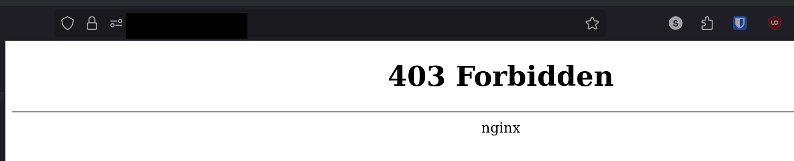

+++
title = 'Proxying AdGuard Home DNS-over-HTTPS with Nginx'
date = 2025-10-28T20:38:03-04:00
draft = false
+++

A few months ago I switched from using Pi-hole to AdGuardHome for serving adblocking DNS to not just the clients in my home, but also my mobile devices.

There were a few reasons for this, but chief among them was its proper support for DNS-over-TLS (DOT) and DNS-over-HTTPS (DOH).

I had previously been running unencrypted DNS via [Tailscale](https://tailscale.com), but because of the way I have things configured, this mean that every DNS request from an external device looked like it was coming from my [subnet router](https://tailscale.com/kb/1019/subnets).

DOT and DOH both support the concept of unique [client IDs](https://github.com/AdguardTeam/AdGuardHome/wiki/Clients), which makes it easier to track down which device a particular request is coming from.

However, one of the few problems that I've encountered with AdGuard is that there's no way to separate the admin interface from the port that DOH uses.

I brought up this conundrum in the Discord server for the since defunct [Self-Hosted Podcast](https://selfhosted.show), and one of the users there (thanks Quietsy!) made an interesting suggestion that I must admit hadn't crossed my mind.

Simply put a reverse proxy in front of the application and implement access controls based on path.

DOH runs over the `/dns-query` endpoint, while the admin interface is at the root `/`.

I logged into the VPS that's running my public-facing AdGuard server and installed nginx.

`sudo apt install nginx`

Then I stopped AdGuard:

```bash
sudo systemctl stop AdGuardHome
```

I then edited `AdGuardHome.yaml` (The path to this file may vary based on how you installed AdGuard).

```bash
sudo vim AdGuardHome.yaml
```

I changed the `https_port` from its default 443 to 4433, and the `http` listening port from 80 to 8080.

Then start AdGuard back up with:

```bash
sudo systemctl start AdGuardHome
```

Then I created a site in Nginx at `/etc/nginx/sites-enabled/adguardhome` with the following settings:

```
proxy_cache_path /var/cache/adguardhome levels=1:2 keys_zone=adguard_cache:10m max_size=3g inactive=120m use_temp_path=off;

upstream adguardhome {
    server 127.0.0.1:4433;
    keepalive 64;
}

server {
    server_name adguard.domain.tld;
    listen 80;
    # listen [::]:80 default_server;

    return 301 https://$host$request_uri;
}

server {
    server_name adguard.domain.tld;
    listen 443 ssl http2;

    access_log /var/log/nginx/agh.access.log;
    error_log /var/log/nginx/agh.error.log warn;

    gzip on;
    gzip_vary on;
    gzip_proxied any;
    gzip_comp_level 6;
    gzip_types text/plain text/css text/xml application/json application/javascript application/rss+xml application/atom+xml image/svg+xml;

    ssl_dhparam /etc/nginx/ssl/dhparam.pem;
    ssl_session_timeout 1d;
    ssl_session_cache shared:MozSSL:10m;
    ssl_session_tickets off;

    ssl_protocols TLSv1.2 TLSv1.3;
    ssl_ciphers ECDHE-ECDSA-AES128-GCM-SHA256:ECDHE-RSA-AES128-GCM-SHA256:ECDHE-ECDSA-AES256-GCM-SHA384:ECDHE-RSA-AES256-GCM-SHA384:ECDHE-ECDSA-CHACHA20-POLY1305:ECDHE-RSA-CHACHA20-POLY1305:DHE-RSA-AES128-GCM-SHA256:DHE-RSA-AES256-GCM-SHA384;
    ssl_prefer_server_ciphers off;

    ssl_certificate /etc/letsencrypt/live/adguard.domain.tld/fullchain.pem;
    ssl_certificate_key /etc/letsencrypt/live/adguard.domain.tld/privkey.pem;

    ssl_early_data on;

    add_header X-Frame-Options "SAMEORIGIN" always;
    add_header X-XSS-Protection "1; mode=block" always;
    add_header X-Content-Type-Options "nosniff" always;
    add_header Referrer-Policy no-referrer;
    add_header Strict-Transport-Security "max-age=63072000" always;
    add_header Permissions-Policy "interest-cohort=()";

    # Discourage Google bots from indexing this site
    add_header X-Robots-Tag "noindex";

    # Allow the dns-query endpoint
    location /dns-query {
    proxy_pass https://adguardhome/dns-query;

    proxy_set_header Host $host;
    proxy_set_header X-Real-IP $remote_addr;
    proxy_set_header X-Forwarded-For $proxy_add_x_forwarded_for;
    proxy_set_header X-Forwarded-Proto $scheme;

    proxy_http_version 1.1;
    proxy_set_header Connection "";

    # Timeouts
    proxy_connect_timeout 90;
    proxy_send_timeout 300;
    proxy_read_timeout 90s;
    }

    # For all other locations, return 403.
    location / {
            return 403;
    }
}
```

Enable and start the webserver:

```bash
sudo systemctl enable --now nginx
```

Now, lets use [doggo](https://github.com/mr-karan/doggo) to test our DOH configuration.

```bash
doggo fedoraproject.org @https://adguard.domain.tld/dns-query/client-id
NAME                    TYPE    CLASS   TTL     ADDRESS         NAMESERVER
fedoraproject.org.      A       IN      47s     8.43.85.67      https://adguard.domain.tld/dns-query/client-id
fedoraproject.org.      A       IN      47s     8.43.85.73      https://adguard.domain.tld/dns-query/client-id
fedoraproject.org.      A       IN      47s     152.2.23.104    https://adguard.domain.tld/dns-query/client-id
fedoraproject.org.      A       IN      47s     34.211.44.206   https://adguard.domain.tld/dns-query/client-id
fedoraproject.org.      A       IN      47s     140.211.169.196 https://adguard.domain.tld/dns-query/client-id
fedoraproject.org.      A       IN      47s     38.145.32.21    https://adguard.domain.tld/dns-query/client-id
fedoraproject.org.      A       IN      47s     152.2.23.103    https://adguard.domain.tld/dns-query/client-id
fedoraproject.org.      A       IN      47s     67.219.144.68   https://adguard.domain.tld/dns-query/client-id
fedoraproject.org.      A       IN      47s     38.145.32.20    https://adguard.domain.tld/dns-query/client-id
```

Perfect!

Now, lets make sure I can't access the admin interface from the public facing nginx...


Awesome.

I am also notably **_NOT_** exposing port 53. Only 853 and 443, both of which are using TCP.
