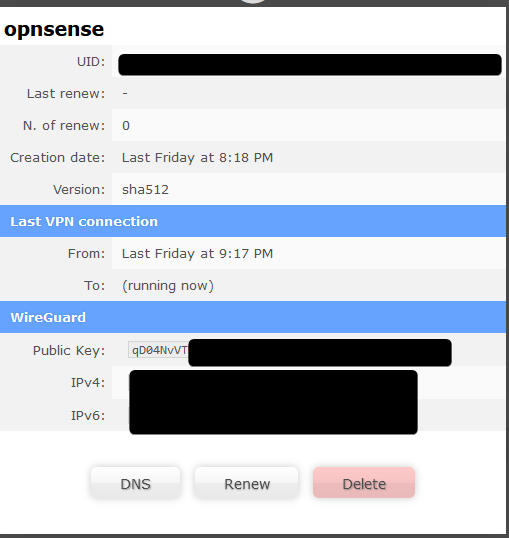
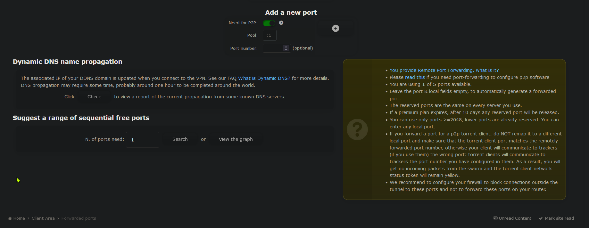

+++
date = '2024-12-03T22:41:53-05:00'
draft = false
title = 'Setting up OpnSense as an AirVPN client'
+++

I recently set up my OpnSense firewall at home with a connection to AirVPN using Wireguard.

It was a bit more complicated than when I did it for Mullvad last year, so I figured I'd document it here for anyone who finds this useful.

## 1. Device Creation

Log into your AirVPN account and navigate to the client area. Click on
Manage Devices. You can either edit the existing "default" device or
create a new one. Either way, I recommend editing the name of the device
so that you know what it is, 6 months down the line. I called mine
"Opnsense".

*While you're here, I recommend opening up a Notepad or equivalent and
copying and pasting the public key that's on this page. We'll need it later.*



## 2. Generate Wireguard configuration file

Next, head back to the client area and head into the Config Generator.

For OS, you'll want to choose "Router". You'll also want to decide which
device (if you have more than one) that this configuration will apply to.

Pick the "Wireguard" protocol.

Pick a server as well - I picked Switzerland.

Once you're done, click the Generate button at the bottom of the page.
This will download a Wireguard configuration file - save this, we'll need
it in a moment.

## 3. Create Wireguard tunnel in Opnsense.

Next, we'll be heading into Opnsense. Log in and navigate to the VPN
section. Under Wireguard, create a peer.

```text
Name: AirVPN 
Public Key: you can get this from the wireguard configuration file you downloaded in step 2.
Pre-Shared Key: you can get this from the wireguard configuration file you
downloaded in Step 2. 
Allowed IPs: 0.0.0.0/0 
Endpoint Address: Get this from the config file as well.
Endpoint port: Get this from the config file as well. It's usually 1637.
Keepalive Interval: You can either set this to 15 or leave it blank.
```

Save, and next we'll head over to Instances. Configure a new instance with the following options:

***Make sure you enable advanced features.***

```text
Name: AirVPNLocal
Public Key: Here you'll want to put the public key we got in step 1. This is the public key of OPNSENSE.
Private Key: Grab this from the config file. It will be under the Interface section.
Tunnel address: Set this to the /32 address that was in the config file. It will be something in the 10.128.0.0/10 range.
Peer: Select the AirVPN peer we created earlier.
MTU: 1320
Disable Routes: Checked 
```

***Make sure you have Disable Routes checked, it's important.***

Hit Save. Don't forget to check the box to enable Wireguard, and hit apply at the bottom of the page.

Once done, head over to the "Status" page - the tunnel should show a status of "Up" now, but we've still got some work to do before we can use it.

## 4. Create an interface.

Head over to Interfaces > Assignments.

Under "Assign a new interface", pick the Wireguard device we just created. If it's your first one, it'll be `wg0`.

Click on the interface, Enable it. I also recommend giving it a descriptive name. Mine is called "airvpn_wg".

## 5. Create a gateway.

Next we have to create a gateway for AirVPN clients to use.

Head over to System > Gateways > Configuration.

Create a new gateway and give it a descriptive name. I called mine AIRVPN_GW.

Here are the other settings you'll need to configure on this gateway.

```text
Interface: airvpn_wg
Address family: IPv4
IP Address: 10.128.0.1
Far Gateway: checked
Disable Gateway Monitoring: checked.
```

Click Save, and then Apply.

## 6. Create Outbound NAT rule.

Most Wireguard VPN providers will require you to configure outbound NAT, and AirVPN is no exception.

Go to Firewall > NAT > Outbound and add a rule.

Configure only the following settings and leave everything else default.

```text
Interface: airvpn_wg
Source Address: LAN net (or whatever you're using.)
Description: Outbound NAT for AirVPN
```

## 7. Configure Policy Routing

How we're going to accomplish this is we're going to create an alias for the devices we want to route out over the VPN tunnel.

Call it VPN_Required or whatever you like.

Once you've created the alias, navigate to Firewall > Rules > Your network.

Create a pass rule with the following settings defined:

```text
Interface: LAN
Protocol: Any
Source: VPN_Required
Destination: Any
Gateway: AIRVPN_GW
Advanced features:
  Set local tag: vpntraffic
```

Next head to Rules > Floating and define a Block rule.

```text
Interface: Your WAN interface
Source: Any
Protocol: Any
Destination: Any
Advanced features:
  Match local tag: vpntraffic
```

This block rule will serve as a "kill switch" preventing our VPN traffic from leaking if the tunnel goes down for some reason.

## 8. Test It

I recommend testing the connection at this point. Add your current device's IP address to the alias you're using for policy routing for testing purposes.

Go to sites like [https://ipleak.net/](https://ipleak.net/) and make sure that everything is reported correctly. Make sure you don't have any DNS leaks, either - it should show DNS servers in the same region as the AirVPN server that you chose.

## 9. Bonus Points - Port Forwarding

If you have a need for port forwarding, AirVPN supports up to 5 ports per account.

Head on back to the Client Area on their website and click on Ports.

*If you're forwarding ports for a protocol like Bittorrent, you'll need to use the `:1` pool of addresses.*

I suggest using AirVPN's tool on the same page to find a free port in that range.



Once you've determined which port to use, configure it for yourself. Configure which device it's for, set the protocol to TCP+UDP.

I recommend using ipv4 only.

On Opnsense, configure a rule on the airvpn_wg interface. (Firewall > Rules > airvpn_wg)

```text
Action: Pass
Protocol: TCP/UDP
Destination: The IP address of your box of Linux ISOs.
Port: the port you defined in AirVPN.
Reply-To: AIRVPN_GW
```

You'll also want to configure a port forward under NAT > Port Forward.

```text
Interface: airvpn_wg
Protocol: TCP/UDP
Destination: airvpn_wg address
Destination port range: the port you defined in AirVPN.
Redirect target IP: The IP address of your box of Linux ISOs.
Redirect target port: the port you defined in AirVPN.
```

Now, in your Bittorrent client, make sure you turn off port randomization, and set the port to the same one.

You may also have to allow that port through the system firewall, if there is one. 

If you're running something like Transmission in Docker, don't forget to publish the port in your docker compose.
