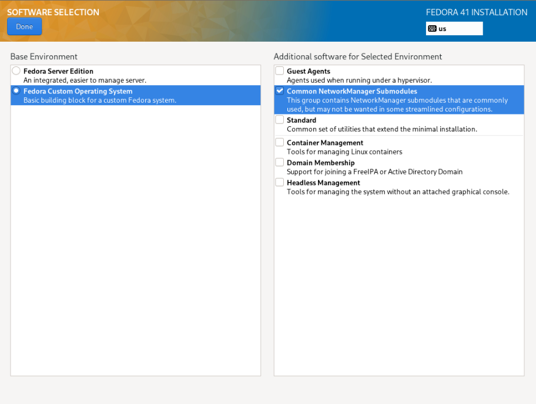
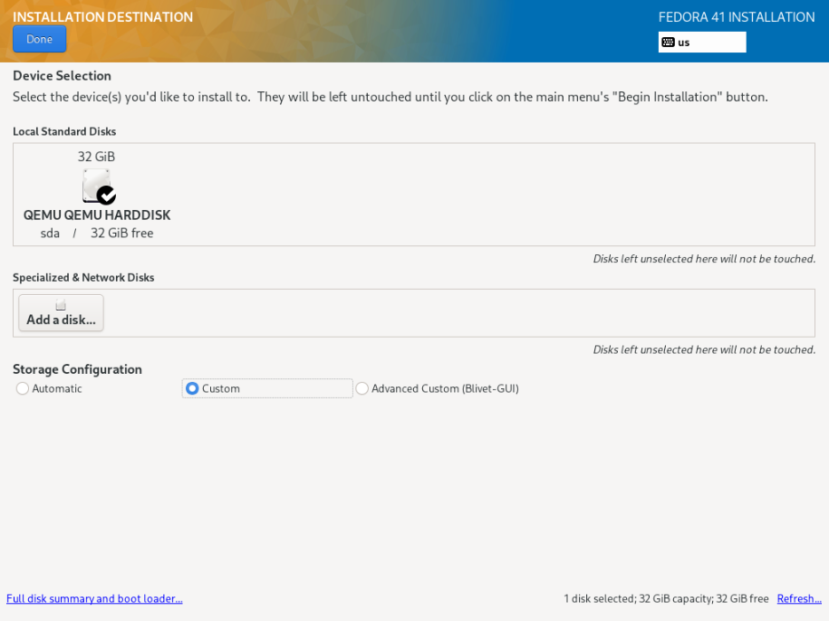
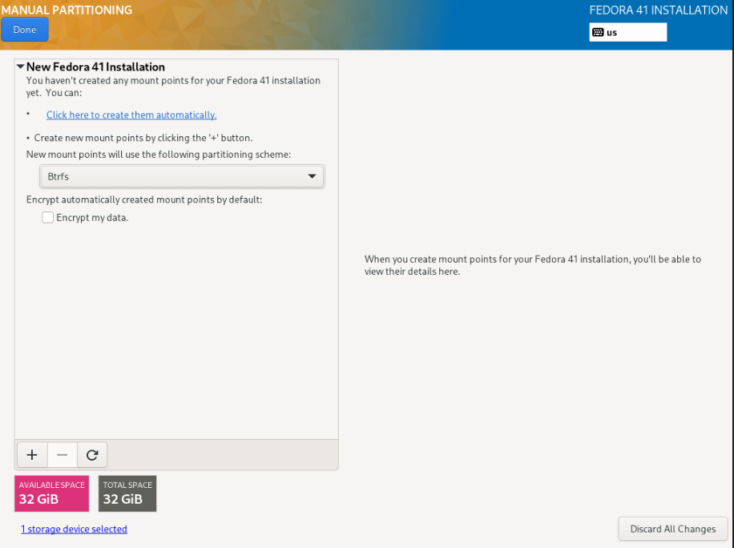
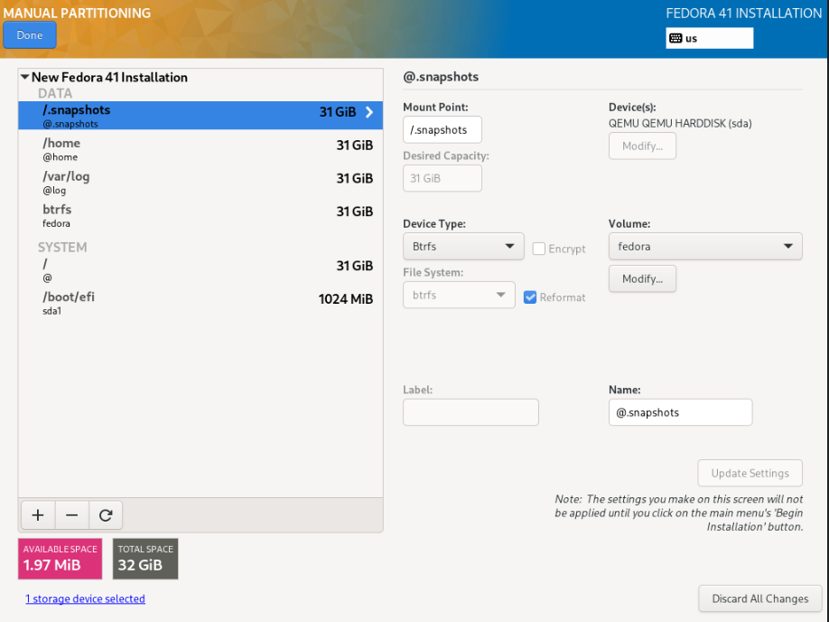

+++
date = '2024-12-08T16:44:53-05:00'
draft = false
title = 'How to build up Fedora Server Edition to a desktop'
+++

# How to build up Fedora Server Edition to a desktop

In this article I'll go over how to take the Fedora Server Edition image and build it up into a full desktop.

## 1. Download the Fedora Server Edition ISO.

Download the latest .iso (DVD) release from [here.](https://fedoraproject.org/server/download)

Burn it to a USB stick using whichever method you prefer, and boot into it.

## 2. Set Software Selections to custom

Once in the Fedora installer, the first step we want to take is to go into "Software Selections" and set it to "custom" instead of the Server Edition.

The "Server Edition" option will install the Cockpit web management package along with the OS. Not something I want installed on my desktop, personally, but if you think that's something you'd like to have, go for it. It will make no difference to the rest of the process.



## 3. Create disk partitions.

Enter the partition layout editor and select "custom".



For the "New mount points" dropdown, pick btrfs.

Click the plus button to create a new partition.



We will create a single partition of 1GB for the EFI bootloader, leaving the rest for the OS and user data.

Set the mountpoint of this partition to `/boot/efi`, and check the box to reformat the disk.
This will allow you to select the "EFI System Partition" type.

For the rest of the disk, create a single btrfs partition.

We will subdivide this using btrfs subvolumes.

Use the + button to create 4 more "partitions", though since we've already occupied the entire disk these will be subvolumes instead of partitions. You can see this by looking on the right side under the "Volume" dropdown. By default the btrfs volume name is "fedora".

There's no real reason to change this, so we'll leave it alone.

1. For the first subvolume, give it a mount point of `/` and change the name from `root` to `@`. 
2. For the second subvolume, the mount point will be `/home` and the name will be `@home`.
3. Subvolume 3 will be mounted at `/var/log` and called `@log`.
4. Subvolume 4 will be mounted at `/.snapshots` and called `@.snapshots`.

Following these naming conventions will allow us to use the `timeshift` snapshotting tool, as it expects the Ubuntu btrfs naming conventions, as I've used here.

If you wish to create any more subvolumes, you can do so now, but that's enough for me.

Here's what it should look like at the end:



Keep in mind that if you'd like to use a different layout than the one I used here, or if you'd like to put your `/home` partition on a different disk entirely, that's entirely OK. 

Just keep in mind - you need *at least* a root partition `/` and an EFI partition `/boot/efi`.

## 4. Create a user

I recommend creating a user at this point with superuser privileges. You can also, if you wish, enable the root account and give it a password, but I won't bother.

## 5. Finish the installation

At this point you can proceed with installing the OS.

Once the installation is done, reboot your machine and log into your new operating system.

## 6. Install updates

You'll be greeted with a command line only interface. Don't worry, we'll fix that in a moment.

First, run the below command and get any pending updates out of the way.

Reboot may or may not be necessary if there's not a new kernel.

```
sudo dnf upgrade && sudo reboot now
```

## 7. Install software.

I don't use a typical desktop environment, I use SwayWM, but I do use GDM as my display manager, so we'll be installing a few Gnome packages.

If you wish to install Gnome instead of Sway, you can use the following command:

```
sudo dnf group install gnome
```

### Install SwayWM

```
sudo dnf group install swaywm
```

### Install the Gnome Display Manager (GDM)

This package will handle our login sessions and give us the nice login screen to log into Sway with.

```
sudo dnf install gdm
```

### Set default systemd target

Right now, the multi-user.target is the default systemd target on login.

If we want our GUI to start upon boot, we need to make this `graphical.target` instead.

```
sudo systemctl set-default graphical.target
```

### Install recommended packages

These packages can be useful if we need to build anything from source, or if you use anything like Neovim with `nvim-treesitter`.

```
sudo dnf install make automake gcc gcc-c++ kernel-devel tar unzip
```

### Install the RPMFusion repos and media codecs.

Red Hat does not bundle these codecs with Fedora, so if you want hardware decoding for H264 and H265 (and you do), run this command to take care of all of that.

```
sudo dnf install https://mirrors.rpmfusion.org/free/fedora/rpmfusion-free-release-$(rpm -E %fedora).noarch.rpm https://mirrors.rpmfusion.org/nonfree/fedora/rpmfusion-nonfree-release-$(rpm -E %fedora).noarch.rpm
```

```
sudo dnf group install multimedia sound-and-video
```

If the above command doesn't work for some reason, try running another `sudo dnf upgrade`.

For some reason the first time I added the rpmfusion repos, the multimedia group wasn't available until after I ran that.

### Extra Goodies

Set dark GTK theme by default:

```
gsettings set org.gnome.desktop.interface color-scheme 'prefer-dark'
```

## Start and enable GDM

```
sudo systemctl enable gdm && sudo systemctl start gdm
```

This will kick you over to the Gnome Display Manager and allow you to log into any desktop environments or Wayland compositors you may have installed.

If you're using Gnome, it will be a very basic installation without any packages to speak of besides the absolute necessities, but this is why we install things from the server edition - to get a more minimal install without bloat.

I've also created a script to make the process of getting things to a full desktop simpler - feel free to use it as a base!

[Fedora setup script gist](https://gist.github.com/BladeWDR/e9c4d794458ec7715133f25a4318ed4e)
