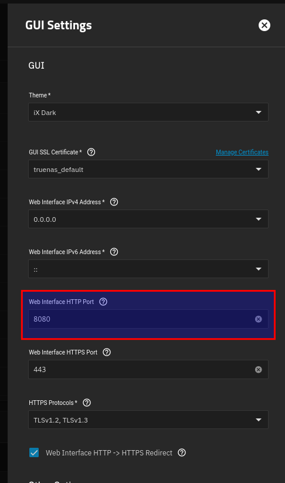
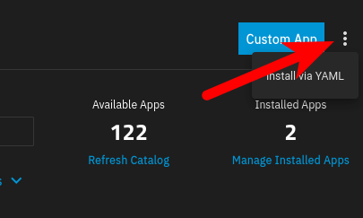

+++
date = '2024-12-16T18:28:57-05:00'
draft = false
title = 'Caching Apt Repositories on TrueNAS'
+++

# Overview

Recently I watched the following YouTube video by [apalrd](https://www.apalrd.net) on how he was using Nginx as a caching reverse proxy for Debian, Ubuntu, and other APT repositories.



I was inspired by this to do the same, but instead of spinning up an LXC for this task, I'm using the built-in Docker functionality in TrueNAS. With [Electric Eel introducing Docker Compose support](https://www.truenas.com/blog/truenas-electric-eel-powers-up-your-storage/), TrueNAS is now far more flexible in this regard.

# Here's how to accomplish this:

## 1. Create ZFS datasets

If you don't already have one, I recommend having a single root dataset to manage all of your docker app configurations. I just called mine `appdata.` With how TrueNAS handles mounting datasets, the mountpoint for this ends up being `/mnt/<poolname>/appdata`. This will be important later. My pool is just named `tank`, so I'll be using that name going forward.

Create 2 child datasets of `appdata` - one for the nginx config, and one for the actual proxy cache (as well as our access.log and error.log)

  - `/mnt/tank/appdata/debcache`
  - `/mnt/tank/appdata/nginx`
  - I recommend setting the owner of these datasets to be `systemd-timesync`, as the UID TrueNAS uses for that user matches up with the UID of the nginx user inside of the container. It will save a lot of headaches with regards to permissions. Alternatively, you could tell Nginx to run as a specific user.

## 2. Create Nginx configuration file

Here's my (slightly modified) version of apalrd's debcache.conf:

```nginx
# Global Cache settings
proxy_cache_path /var/debcache/cache levels=2:2 keys_zone=generic:500m inactive=90d max_size=1000g min_free=5g loader_files=1000 loader_sleep=50ms loader_threshold=300ms use_temp_path=off;
# Log with cache status
log_format cachelog '$remote_addr [$time_local] "$request" $status "$http_user_agent" "$upstream_cache_status"';

# URI paths to avoid cache
# These paths will change to indicate new release contents
# All other .deb files can be cached nearly indefinitely, as the
# version number is coded into the file name.
map $request_uri $nocache {
    ~InRelease 1;
    ~Release 1;
    ~Contents 1;
}

# Deb Server
server {
    # IF you need legacy IP, enable this one
    listen 80 reuseport;

    #Log settings
    access_log /var/debcache/access.log cachelog;
    error_log /var/debcache/error.log;


    # Cache Location
    slice 1m;
    proxy_cache generic;
    proxy_ignore_headers Expires Cache-Control;
    proxy_cache_valid 200 206 90d;
    proxy_cache_valid 301 302 0;
    proxy_set_header  Range $slice_range;
    proxy_cache_lock on;
    proxy_cache_lock_age 2m;
    proxy_cache_lock_timeout 1h;
    proxy_cache_use_stale error timeout invalid_header updating http_500 http_502 http_503 http_504;
    proxy_cache_revalidate on;
    #Nocache for those entries
    proxy_cache_bypass $nocache;
    proxy_no_cache $nocache;
    # 1G max file
    proxy_max_temp_file_size 1024m;
    # Cache key
    proxy_cache_key      $http_host$uri$slice_range;
    # Upstream Configuration
    proxy_next_upstream error timeout http_404;
    # Cache status
    add_header X-Cache-Status $upstream_cache_status;
    proxy_redirect off;
    proxy_ignore_client_abort on;
    # Upstream request headers
    proxy_ssl_server_name on;

    # Redirect Locations
    # Must include trailing slash!

    # Debian
    location /debian/ {
        proxy_pass http://deb.debian.org/debian/;
        proxy_set_header Host "deb.debian.org";
    }
    location /debsec/ {
        proxy_pass http://deb.debian.org/debian-security/;
        proxy_set_header Host "deb.debian.org";
    }

    # Ubuntu
    location /ubuntu/ {
        proxy_pass http://us.archive.ubuntu.com/ubuntu/;
        proxy_set_header Host "us.archive.ubuntu.com";
    }
    location /ubusec/ {
        proxy_pass http://security.ubuntu.com/ubuntu/;
        proxy_set_header Host "security.ubuntu.com";
    }

    # Kali
    location /kali/ {
        proxy_pass http://http.kali.org/kali/;
        proxy_set_header Host "http.kali.org";
    }

    # Proxmox (non-enterprise)
    location /proxmox/ {
        proxy_pass http://download.proxmox.com/debian/;
        proxy_set_header Host "download.proxmox.com";
    }

    # Caddy Server
    location /caddy/ {
        proxy_pass https://dl.cloudsmith.io/public/caddy/stable/deb/debian/;
        proxy_set_header Host "dl.cloudsmith.io";
    }

    # Nodesource NodeJS
    location /node/ {
        proxy_pass https://deb.nodesource.com/node_20.x/;
        proxy_set_header Host "deb.nodesource.com";
    }

    # Stats endpoint
    location = /nginx_status {
        stub_status;
    }

    # Static Files (conversion scripts)
    root /var/debcache/static/;
    autoindex on;
}
```

{}
**Save this configuration file to `/mnt/tank/appdata/nginx/debcache.conf` on your TrueNAS server.**
{}

**Some notes on what I've changed:**

- Inactive items are only kept for 90 days instead of 10 years.
- Fixed a missing slash in the nodesource repository (by the time you read this it may be fixed on apalrd's original post).

## 3. Change the HTTP listening port for the TrueNAS GUI so that Nginx can bind that port instead.

  - Go to System > General Settings and click on `Settings` under the GUI box.
  - Change the Web Interface HTTP port to something other than 80. I've set mine to 8080.



## 4. Install Nginx as a custom app

Go to the `Apps` screen, click on `Discover Apps`, and click on the three dots to the right of `Custom App`. You should have an option to `Install via YAML`.



Paste the below compose syntax into the `Custom Config` box. Change the path names if necessary.

  ```yaml
  services:
    nginx:
      container_name: nginx-debcache
      image: nginx
      ports:
        - '80:80'
      restart: unless-stopped
      volumes:
        - /mnt/tank/appdata/debcache:/var/debcache
        - /mnt/tank/appdata/nginx:/etc/nginx/conf.d:ro
  ```

Click save, and the Nginx container should deploy.

You can test the configuration by going to `http://your-truenas-ip/debian`. It should be proxying the Debian apt repository. If you see the index for that repo, the proxy is working.

## 5. Configure a DNS record (optional)

This step is technically optional, but I recommend it. Whatever you're using for local DNS resolution, whether it be PiHole, BIND, dnsmasq, etc - create a DNS A record or CNAME for TrueNAS that you'll use for this specific purpose.

## 6. Modify your sources.list files

I recommend either using the script that apalrd created, or the [Ansible playbook that I wrote.](https://gist.github.com/BladeWDR/355fe911e00dab959846db21a9084769). 

Please leave a comment if you run into any problems with the playbook - I have come across one or two edge cases that I didn't account for already - if there are any more, please let me know which repositories and I will attempt to fix it. No promises on turnaround time, though. :P

# Conclusion

And that's all she wrote! You should now have a caching web proxy running off your TrueNAS server with access to that big honking storage array you've got in your basement with all the Linux ISOs on it.

Please leave a comment if you found this useful.
