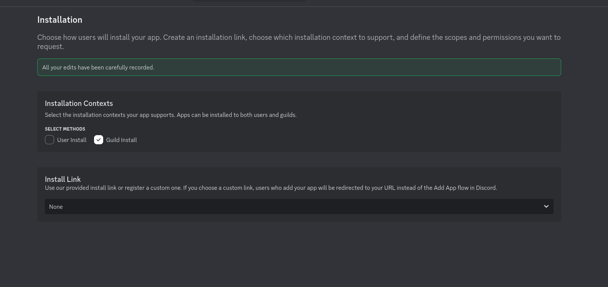
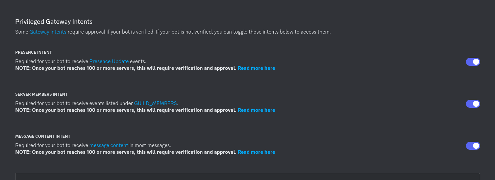
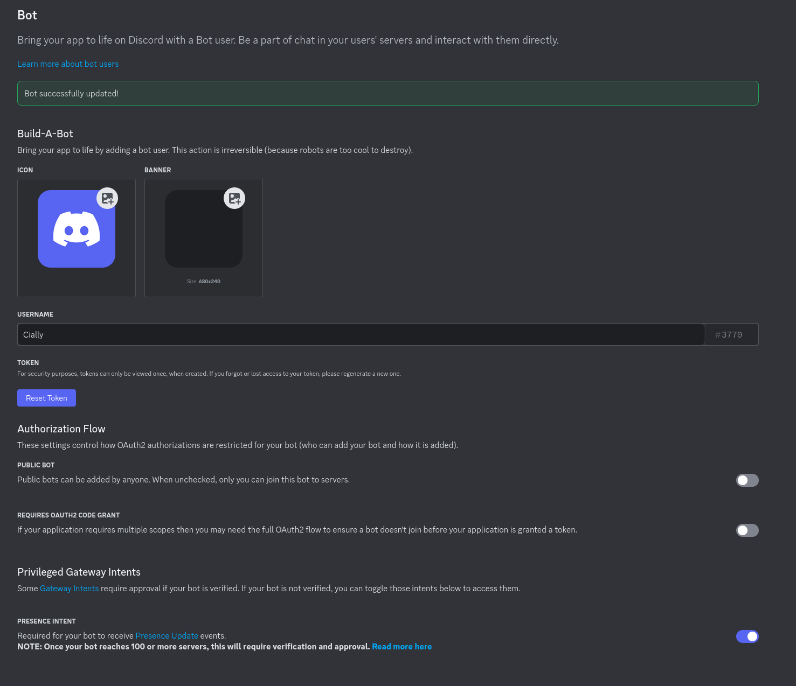
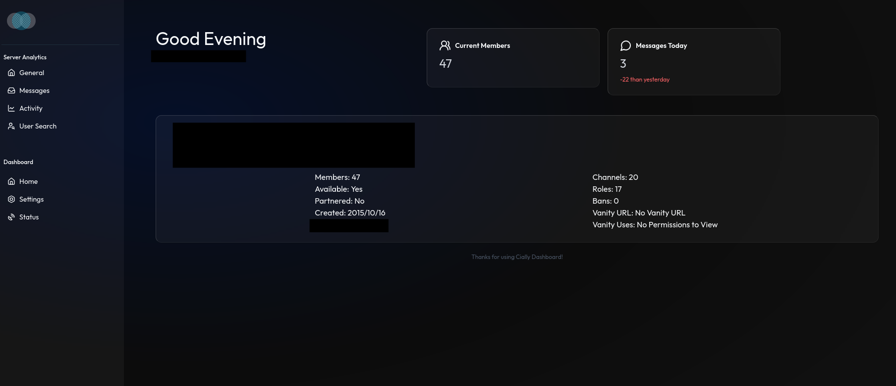

+++
title = 'How to set up the Cially Dashboard for Discord'
date = 2025-05-19T21:46:40-04:00
draft = false
+++

# How to set up the Cially Dashboard for Discord

[Cially](https://github.com/cially/cially) is a dashboard for Discord that shows you interesting statistics regarding your server, or multiple servers.

I'm going to show you how to get it set up on your own system using Docker.

{}
This guide does assume some familiarity with Docker and Docker Compose, as well as Linux in general.
{}

## 1. Setting up an application

Cially takes the form of a Discord bot. In order for your bot to join a server you have to create an application for it in your Discord developer account portal.

1. Go to the [Discord Developer Portal](https://discord.com/developers/applications) and create a new application. You can call it whatever you wish, I called mine "Cially."
2. Under "Installation", set "Install Link" to "None", and uncheck "User Install".
   
3. Under "Bot":
   - Enable all three sliders under "Privileged Gateway Intents."
     
   - Uncheck "Public Bot". (Unless you would like other people to be able to add your bot to their servers, too.) If you get an error with this step, make sure you completed 'set Install Link to None in step 2.'
   - Click the "Reset" button to get your bot token. Save this in a text editor, we'll need it when setting up the bot on our server. This will only be shown once, so if you lose it, you'll have to reset it again. I keep this in my password manager vault to make sure I don't lose it.
     
4. Under "Oauth2":
   - Copy the Client ID from the Oauth2 screen and save it with the bot token you copied earlier.
   - Give the bot the following Oauth2 scopes: ([Source](https://discordjs.guide/preparations/adding-your-bot-to-servers.html#creating-and-using-your-invite-link))
     - bot
     - applications.commands
   - At the bottom of the screen it will give you a URL. Paste that into your browser, and it should prompt you to join the bot to one of your servers.

## 2. Setting up Cially in Docker

This is a relatively complicated docker compose file. The project provides one, but I chose to take it and make some changes so it would work behind my Traefik reverse proxy.

Either one works, but if you'd like to use my compose file, this is it:

```yaml
networks:
  traefik:
    external: true

services:
  cially:
    image: ghcr.io/skellgreco/cially-bot:${CIALLY_DOCKER_TAG:-latest}
    container_name: ${CIALLY_CONTAINER_NAME:-cially}
    restart: ${CIALLY_RESTART:-unless-stopped}
    mem_limit: ${CIALLY_MEM_LIMIT:-200g}
    env_file:
      - .env
    networks:
      - traefik
    volumes:
      - ./config:/config
      - /etc/localtime:/etc/localtime:ro
    environment:
      - PUID=${PUID:-1000}
      - PGID=${PGID:-1000}
      - TZ=${TZ}
      - TOKEN=${CIALLY_BOT_TOKEN}
      - CLIENT_ID=${CIALLY_BOT_CLIENT_ID}
      - API_URL=http://cially:3001
      - DEBUGGING=${CIALLY_BOT_DEBUGGING:-FALSE}
      - POCKETBASE_URL=http://pocketbase:8090
      - GUILD_COLLECTION=guilds
      - MESSAGE_COLLECTION=messages
      - INVITE_COLLECTION=invites
      - MEMBER_LEAVES_COLLECTION=member_leaves
      - MEMBER_JOINS_COLLECTION=member_joins
      - PORT=3001
    depends_on:
      - pocketbase
      - cially-web
    labels:
      - com.centurylinklabs.watchtower.enable=${CIALLY_WATCHTOWER_ENABLED:-true}
      - autoheal=${CIALLY_AUTOHEAL_ENABLED:-true}

  cially-web:
    image: ghcr.io/skellgreco/cially-web:latest
    container_name: cially-web
    restart: unless-stopped
    environment:
      # Runtime environment variables
      - NEXT_PUBLIC_BOT_API_URL=http://cially:3001
      - POCKETBASE_URL=http://pocketbase:8090
      - MESSAGE_COLLECTION=messages
      - INVITE_COLLECTION=invites
      - MEMBER_LEAVES_COLLECTION=member_leaves
      - MEMBER_JOINS_COLLECTION=member_joins
      - GUILDS_COLLECTION=guilds
    env_file:
      - .env
    depends_on:
      - pocketbase
    labels:
      - joyride.host.name=${CIALLY_HOST_NAME:-cially}.${HOST_DOMAIN}
      - traefik.enable=${CIALLY_TRAEFIK_ENABLED:-true}
      - traefik.http.routers.cially.entrypoints=websecure
      - traefik.http.routers.cially.rule=Host(`${CIALLY_HOST_NAME:-cially}.${HOST_DOMAIN}`)
      - traefik.http.services.cially.loadbalancer.server.port=3000
      - com.centurylinklabs.watchtower.enable=${CIALLY_WATCHTOWER_ENABLED:-true}
      - autoheal=${CIALLY_AUTOHEAL_ENABLED:-true}
    networks:
      - traefik

  # Need to expose this via Traefik as well since the user needs to log into Pocketbase and configure it.
  pocketbase:
    image: ghcr.io/keksiqc/pocketbase:0.26.6
    container_name: cially-pocketbase
    restart: unless-stopped
    env_file:
      - .env
    volumes:
      - ./pocketbase-data:/pb/pb_data
    networks:
      - traefik
    labels:
      - joyride.host.name=${CIALLY_POCKETBASE_HOST_NAME:-cially-pb}.${HOST_DOMAIN}
      - traefik.enable=${CIALLY_TRAEFIK_ENABLED:-true}
      - traefik.http.routers.cially-pb.entrypoints=websecure
      - traefik.http.routers.cially-pb.rule=Host(`${CIALLY_POCKETBASE_HOST_NAME:-cially-pb}.${HOST_DOMAIN}`)
      - traefik.http.services.cially-pb.loadbalancer.server.port=8090
      - com.centurylinklabs.watchtower.enable=${CIALLY_WATCHTOWER_ENABLED:-true}
      - autoheal=${CIALLY_AUTOHEAL_ENABLED:-true}
```

Like I said, this is a doozy, and unusually, it's not as simple as `docker compose up` and it works. There's one or two extra steps required.

Log into your server and create a new folder for Cially.

1. `sudo mkdir -p /apps/cially`
2. `sudo chown -R $USER:USER /apps/cially && cd /apps/cially`
3. Now, create a .env file in this directory: `vim .env` or `nano .env`
4. Add the following two environment variables, replacing them with your Client ID and token where appropriate:

   ```ini
   CIALLY_BOT_TOKEN=<BOT_TOKEN_GOES_HERE>
   CIALLY_BOT_CLIENT_ID=<CLIENT_ID_GOES_HERE>
   ```

5. Save and exit the file.
6. Create your docker compose file, either using mine from above, or the one from the project's [GitHub](https://github.com/cially/cially/blob/main/docker-compose.yaml).

{}
Keep in mind if you use my compose file - I am not exposing _any_ ports because everything is being routed through Traefik. If you want to expose them, you'll have to re-add the `ports` key.
{}

7. Run `docker compose up -d`.
8. Now, we need to import the collections provided by the Cially team into Pocketbase, which is one of the containers that the compose file is spinning up. But first, we need to log into Pocketbase and create a user account. To do so:
   - Run `docker logs <pocketbase-container-name>`
   - In the standard output for that container, you will see an http://0.0.0.0 URL. Copy and paste it into your browser, and replace `0.0.0.0` with the IP address of your server or your fully qualified domain name, if you're using a reverse proxy.
   - Set up a user account for Pocketbase when prompted.
   - Once you've logged into Pocketbase, navigate to Settings, and then Import Collections.
   - You'll need to paste the content from the [JSON file](https://github.com/cially/cially/blob/main/pocketbase/pb_schema.json) that's provided for this purpose.
9. Once you've done so, I recommend giving everything a restart just to be on the safe side.
   `docker compose up -d --force-recreate`
10. At this point, you should be able to navigate to the IP address of your server on port 3000, or to your fully qualified domain name and see the Cially dashboard. It will take a few minutes for your server to become available as Cially collects data.
    
