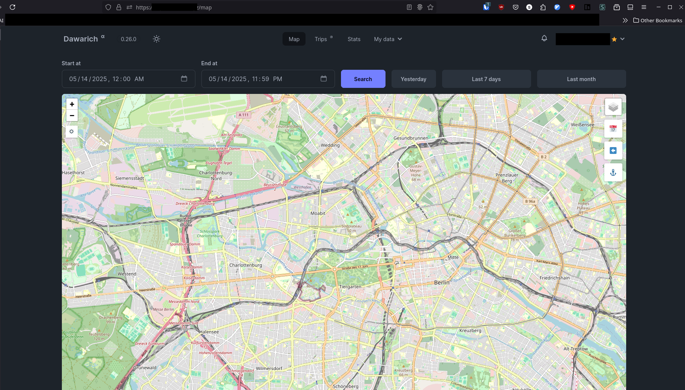
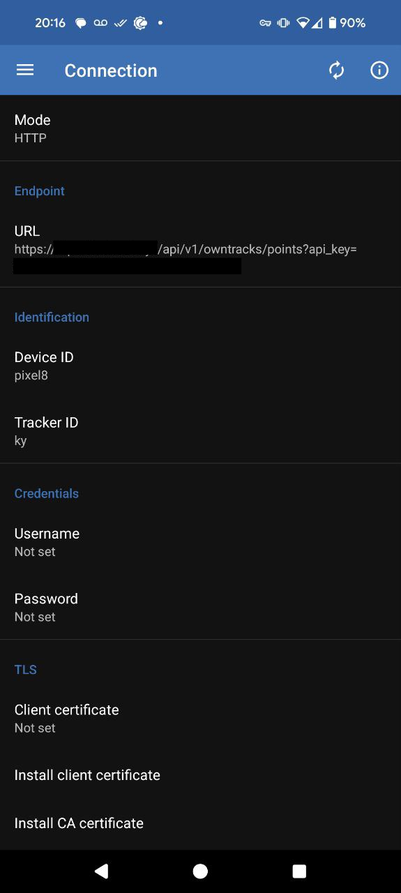

+++
title = 'Dawarich - A Google Location History Alternative'
date = 2025-05-14T19:13:45-04:00
draft = false
+++

Continuing on the theme of moving all of my stuff out of _other people's cloud_ and into mine - I was recently made aware of [Dawarich](https://dawarich.app) while listening to the [Linux Unplugged](https://linuxunplugged.com/) podcast.

This is touted as an alternative to Google's Location History feature, which is something that I use frequently. I need it to account for my time at work, so it's fairly important that I have a solution like this.

I chose to set this up on one of my VPS machines at Linode rather than running it in my house. The logic behind this being that a datacenter is most likely going to have more reliable power than I do at my house.

That said, I don't think I'm going to be going through the work of making this truly highly-available - it's just not worth the headache when I'm the only user.

## Installation

As always, I set this up using their provided Docker image.

Dawarich can do either an HTTP or MQTT backend. I already have a webserver on this VPS, so I'll be using HTTP.

I _highly_ recommend setting up valid HTTPS certificates for this. I'm using free certificates from [LetsEncrypt](https://letsencrypt.org/). The Traefik reverse proxy I'm using has an ACME client built right in, which is very handy.

The compose file for this app is quite the doozy. The project provides one, but I made some of my own changes, and added labels for Traefik.

```yaml
networks:
  traefik:
    external: true

services:
  dawarich:
    image: freikin/dawarich:${DAWARICH_DOCKER_TAG:-latest}
    container_name: ${DAWARICH_CONTAINER_NAME:-dawarich}
    restart: ${DAWARICH_RESTART:-unless-stopped}
    volumes:
      - /etc/localtime:/etc/localtime:ro
    networks:
      - traefik
    stdin_open: true
    tty: true
    entrypoint: web-entrypoint.sh
    command: ["bin/rails", "server", "-p", "3000", "-b", "::"]
    environment:
      - RAILS_ENV=production
      - REDIS_URL=redis://dawarich_redis:6379/0
      - DATABASE_HOST=dawarich_db
      - DATABASE_PORT=5432
      - DATABASE_USERNAME=${DAWARICH_POSTGRES_USER:-postgres}
      - DATABASE_PASSWORD=${DAWARICH_POSTGRES_PW:-password}
      - DATABASE_NAME=dawarich_production
      - MIN_MINUTES_SPENT_IN_CITY=${DAWARICH_MIN_MINS:-30}
      - APPLICATION_HOSTS=localhost,::1,127.0.0.1,${DAWARICH_HOST_NAME:-dawarich}.${HOST_DOMAIN}
      - TIME_ZONE=${TZ}
      - APPLICATION_PROTOCOL=http
      # Can be either km or mi
      - DISTANCE_UNIT=${DAWARICH_DISTANCE_UNIT:-mi}
      - PROMETHEUS_EXPORTER_ENABLED=false
      - PROMETHEUS_EXPORTER_HOST=0.0.0.0
      - PROMETHEUS_EXPORTER_PORT=9394
      - SECRET_KEY_BASE=1234567890
      - RAILS_LOG_TO_STDOUT="true"
      # SMTP settings
      - SMTP_SERVER=${DAWARICH_SMTP_SERVER}
      - SMTP_PORT=${DAWARICH_SMTP_PORT}
      - SMTP_USERNAME=${DAWARICH_SMTP_USERNAME}
      - SMTP_PASSWORD=${DAWARICH_SMTP_PASSWORD}
      - SMTP_FROM=${DAWARICH_SMTP_FROM}
      - SMTP_DOMAIN=${DAWARICH_SMTP_DOMAIN}
    logging:
      driver: "json-file"
      options:
        max-size: "100m"
        max-file: "5"
    healthcheck:
      test:
        [
          "CMD-SHELL",
          "wget -qO - http://127.0.0.1:3000/api/v1/health | grep -q '\"status\"\\s*:\\s*\"ok\"'",
        ]
      interval: 10s
      retries: 30
      start_period: 30s
      timeout: 10s
    depends_on:
      dawarich_db:
        condition: service_healthy
        restart: true
      dawarich_redis:
        condition: service_healthy
        restart: true
    deploy:
      resources:
        limits:
          cpus: "0.50" # Limit CPU usage to 50% of one core
          memory: "4G" # Limit memory usage to 2GB
    labels:
      - joyride.host.name=${DAWARICH_HOST_NAME:-dawarich}.${HOST_DOMAIN}
      - traefik.enable=${DAWARICH_TRAEFIK_ENABLED:-true}
      - traefik.http.routers.dawarich.entrypoints=websecure
      - traefik.http.routers.dawarich.rule=Host(`${DAWARICH_HOST_NAME:-dawarich}.${HOST_DOMAIN}`)
      # - traefik.http.services.dawarich.loadbalancer.server.scheme=https # enable if the service wants to connect over https
      - traefik.http.services.dawarich.loadbalancer.server.port=3000
      - com.centurylinklabs.watchtower.enable=${DAWARICH_WATCHTOWER_ENABLED:-true}
      - autoheal=${DAWARICH_AUTOHEAL_ENABLED:-true}

  dawarich_sidekiq:
    image: freikin/dawarich:${DAWARICH_DOCKER_TAG:-latest}
    container_name: dawarich_sidekiq
    volumes:
      - ./etc/dawarich/public:/var/app/public
      - ./etc/dawarich/watched:/var/app/tmp/imports/watched
      - ./etc/dawrich/storage:/var/app/storage
    networks:
      - traefik
    stdin_open: true
    tty: true
    entrypoint: sidekiq-entrypoint.sh
    command: ["bundle", "exec", "sidekiq"]
    restart: on-failure
    environment:
      - RAILS_ENV=production
      - REDIS_URL=redis://dawarich_redis:6379/0
      - DATABASE_HOST=dawarich_db
      - DATABASE_PORT=5432
      - DATABASE_USER=${DAWARICH_POSTGRES_USER:-postgres}
      - DATABASE_PASSWORD=${DAWARICH_POSTGRES_PW:-password}
      - DATABASE_NAME=dawarich_production
      - APPLICATION_HOSTS=localhost,::1,127.0.0.1,${DAWARICH_HOST_NAME:-dawarich}.${HOST_DOMAIN}
      - BACKGROUND_PROCESSING_CONCURRENCY=10
      - APPLICATION_PROTOCOL=http
      - DISTANCE_UNIT=km
      - PROMETHEUS_EXPORTER_ENABLED=false
      - PROMETHEUS_EXPORTER_HOST=dawarich
      - PROMETHEUS_EXPORTER_PORT=9394
      - SECRET_KEY_BASE=1234567890
      - RAILS_LOG_TO_STDOUT="true"
    logging:
      driver: "json-file"
      options:
        max-size: "100m"
        max-file: "5"
    healthcheck:
      test:
        ["CMD-SHELL", "bundle exec sidekiqmon processes | grep $${HOSTNAME}"]
      interval: 10s
      retries: 30
      start_period: 30s
      timeout: 10s
    depends_on:
      dawarich_db:
        condition: service_healthy
        restart: true
      dawarich_redis:
        condition: service_healthy
        restart: true
      dawarich:
        condition: service_healthy
        restart: true
    deploy:
      resources:
        limits:
          cpus: "0.50" # Limit CPU usage to 50% of one core
          memory: "4G" # Limit memory usage to 2GB

  dawarich_redis:
    image: redis:7.4-alpine
    container_name: dawarich_redis
    command: redis-server
    networks:
      - traefik
    volumes:
      - ./etc/dawarich/redis:/var/shared/redis
    restart: always
    healthcheck:
      test: ["CMD", "redis-cli", "--raw", "incr", "ping"]
      interval: 10s
      retries: 5
      start_period: 30s
      timeout: 10s

  dawarich_db:
    image: postgis/postgis:17-3.5-alpine
    shm_size: 1G
    container_name: dawarich_db
    volumes:
      - ./etc/dawarich/db:/var/lib/postgresql/data
    networks:
      - traefik
    environment:
      - POSTGRES_USER=${DAWARICH_POSTGRES_USER:-postgres}
      - POSTGRES_PASSWORD=${DAWARICH_POSTGRES_PW:-password}
      - POSTGRES_DB=dawarich_production
    restart: always
    healthcheck:
      test: ["CMD", "pg_isready", "-U", "postgres"]
      interval: 10s
      retries: 5
      start_period: 30s
      timeout: 10s
```

And here are the environment variables that I have set.

```env
DAWARICH_SMTP_SERVER=mail.mydomain.net
DAWARICH_SMTP_PORT=465
DAWARICH_SMTP_USERNAME=no-reply@mydomain.net
DAWARICH_SMTP_PASSWORD=<your password here>
DAWARICH_SMTP_FROM=no-reply@mydomain.net
DAWARICH_SMTP_DOMAIN=mydomain.net
DAWARICH_HOST_NAME=trips
DAWARICH_POSTGRES_PW=changeme
HOST_DOMAIN=mydomain.net
DAWARICH_SECRET_KEY_BASE=changeme # you can generate this with openssl rand -hex 32
```



## Configuration

Most of the configuration is done for you already via the provided environment variables.

I will also note here that while I've included the settings for SMTP - I have yet to actually get it working.

From what I understand, SMTP support is relatively new to this application, so it could be either me being hamfisted, or an actual bug. I have not sorted that out yet.

But it's not critical, so I chose to leave it there and move on.

The default username and password are `demo@dawarich.app` and `password`. Obviously we'll need to change this... but this is more complicated than you might expect, as I'll get to in a moment.

## Nitpicks

User management in the Dawarich web UI is _extremely_ basic, almost to the point of being useless. The only thing you can do is create a new, unprivileged user.

If you want to create a new admin account and get rid of the default one, you'll have to drop into the Ruby console for that.

This is detailed on their website, but it's not ideal.

## Fixes

### To create a new admin user

First, create a new user from the web interface.

Then do the following steps on the command line:

```bash
# Shell into the container
docker exec -it dawarich_app /bin/sh
# Enter the Ruby console
bin/rails console
```

```ruby
# Promote your user to admin
User.find_by(email: 'user@example.com').update(admin: true)
# Exit the ruby console.
exit
```

If you'd like to delete the default admin user (and I recommend that you do) enter this command before exiting the Ruby console:

```ruby
User.find_by(email: 'demo@dawarich.app').destroy
```

## Using Dawarich with OwnTracks

Using Dawarich with [OwnTracks](https://owntracks.org/) is quite straightforward.

### Get API URL

- Log into the Dawarich web interface.
- Click on your email address in the top right hand side of the page and go to Account.
- From there you can copy the API URL example they've provided for OwnTracks.

### Configuring the app

- Install the app on your smartphone from your app store of choice (I like using F-Droid whenever possible) and then go into Preferences
- In Preferences, click on Connection
- Change the Mode to HTTP
- Enter the URL into the provided field.
- You do **_not_** need to set a username and password under Credentials - the URL you copied earlier contains the needed API key for authentication.


