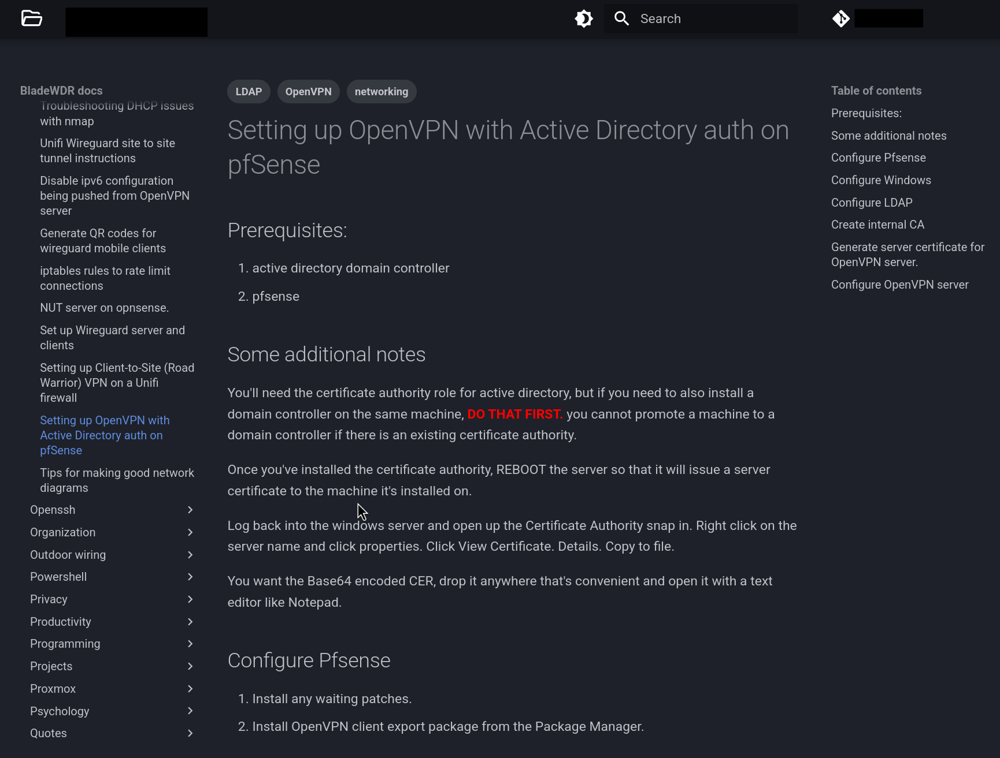

+++
title = 'Creating your own documentation with Mkdocs and Obsidian'
date = 2026-03-21T17:32:53-04:00
draft = false
+++

# Creating your own documentation with Mkdocs and Obsidian

## Overview

One of the most important parts of being in any highly technical profession is documentation.

There are many products centered around doing this, even plenty that are free and open source as I prefer.

However, many of these products rely on databases and force me to use editors that are not my preference.

I like keeping my notes in Markdown format, so that they are both portable and can be manipulated with common tools on the Linux command line like `grep`, `awk`, `sed`.

This also allows me to keep them in version control.

However, I also enjoy the convenience of having a web portal that's easily accessible from any device, and searchable even from my phone.

Full disclosure, this guide assumes at least some knowledge about Docker and Git - if I tried to get into those too, this post would be miles long.

## The Tools

These are the tools that I use to do my documentation:

### The Static Site Generator

- [Material for Mkdocs](https://squidfunk.github.io/mkdocs-material/) - This takes in Markdown files and generates HTML from them, allowing you to serve that content as a website.
- You'll also need the [Mkdocs Obsidian Bridge](https://github.com/GooRoo/mkdocs-obsidian-bridge) plugin so that Mkdocs can understand the Obsidian-style wikilinks. Links like this - `[[My Note]]` are Obsidian style links.

### Editors

I enjoy the ideas behind the [Obsidian](https://obsidian.md/) project, but my issues with it are:

1. It's closed source.
2. I like doing all my writing in [Neovim](https://neovim.io). You'll want to install the [Obsidian.nvim](https://github.com/obsidian-nvim/obsidian.nvim) plugin to allow it to interact more natively with Obsidian vaults.

You can apply all of these ideas using the actual Obsidian editor (or any other editor with Markdown support) if you so choose.

I do, however, use the Obsidian mobile app when I need to write notes on mobile. The [GitSync](https://gitsync.viscouspotenti.al/) Android app allows me to keep the remote repository in sync.

### Continuous Deployment Workflow

I'm accomplishing this with [Forgejo](https://forgejo.org/) and an [Nginx](https://nginx.org/) webserver.

## The Workflow

1. I edit all of my notes in Markdown using Neovim.
2. I push the changes to my Forgejo repository.
3. Forgejo has a configured [Action](https://forgejo.org/docs/latest/user/actions/reference/) that builds the site using a [Runner](https://forgejo.org/docs/next/admin/actions/runner-installation/) and then copies it to Docker webserver.

The reason I like this so much is that it reduces friction for entering notes significantly, and also allows me to link notes together logically.

## Setting It Up

If you want to get this set up yourself you can follow these steps.

1. Install the Obsidian official app and create the vault. There's probably a way to do this without installing it, but to make sure that it's formatted correctly and has the correct directory structure, this is the easiest way.
2. Install the `obsidian.nvim` plugin (optional, only if you're using Neovim).
3. Create a .gitignore file to exclude some files that are problematic or unnecessary to keep in git.

    ```bash
    cd $VAULT
    vim .gitignore
    ```

    The file should have the following contents:

    ```bash
    .obsidian/workspace*.json
    .obsidian/plugins/recent-files-obsidian/data.json
    site/ # This is where Material for Mkdocs will build your site by default. There's no need to include this in Git version control.
    ```

4. Create a new git repository in the same directory as your Obsidian vault.

    ```bash
    git init
    git switch -c main
    git add . # Or add only a subset of files if you wish
    git commit -m "initial commit"
    git remote add origin ssh://git@git.example.tld/example/docs.git # Add an existing remote
    git push -u origin main # Push your local changes to the remote
    ```

    At this point if you log into the repository you created, you should see the raw markdown files from your Obsidian vault.

5. Now, we'll create a new file at the root of your repository called `mkdocs.yml`. This file is how you configure the mkdocs site. Here's mine with some information redacted.

    ```yaml
    ---
    site_name: Documentation site
    site_url: https://wiki.example.tld
    repo_name: ssbtech/wiki
    repo_url: https://git.example.tld/ssbtech/wiki
    edit_uri: 'docs/'

    theme:
      name: material
      features:
        - navigation.indexes
        - navigation.instant
        - content.code.copy
      language: en
      favicon: assets/images/homer.png
      icon:
        repo: fontawesome/brands/git-alt
        logo: fontawesome/regular/folder-open
      palette:
        # Palette toggle for light mode
        - media: "(prefers-color-scheme: light)"
          scheme: default
          primary: blue
          accent: teal
          toggle:
            icon: material/brightness-7
            name: Switch to dark mode
        # Palette toggle for dark mode
        - media: "(prefers-color-scheme: dark)"
          scheme: slate
          accent: teal
          primary: black 
          toggle:
            icon: material/brightness-4
            name: Switch to light mode
    markdown_extensions:
      - admonition
      - attr_list
      - md_in_html
      - mdx_truly_sane_lists
      - toc:
          permalink: true
      - def_list
      - pymdownx.tasklist:
          custom_checkbox: true
    plugins:
      - search
      - obsidian-bridge
      - tags:
    ```

6. Install mkdocs and its plugins.
    ```bash
    pip install mkdocs-material mkdocs-obsidian-bridge mdx_truly_sane_lists
    ```
7. You can test the site by running `mkdocs serve`. It will build the site and expose it on port 8000, so you can see what it looks like.
8. Every git forge is a little different on how you can configure your Actions, but this is how I have mine configured on Forgejo:

    ```yaml
    name: Build and Deploy Wiki
    on: [push]
    enable-email-notifications: true

    jobs:
      deploy:
        runs-on: wiki
        container:
          image: squidfunk/mkdocs-material:9.7.6
        steps:
          - name: Install dependencies
            run: |
              apk add --no-cache nodejs # needed for the Forgejo checkout action
              apk add rsync openssh-client
              pip install mkdocs-obsidian-bridge mdx_truly_sane_lists

          - uses: actions/checkout@v4
          
          - name: Build site
            run: mkdocs build
          
          - name: Deploy via rsync
            run: |
              eval $(ssh-agent -s)
              mkdir -p ~/.ssh
              chmod 700 ~/.ssh
              echo "${{ secrets.SSH_PRIVATE_KEY }}" | tr -d '\r' | ssh-add - > /dev/null
              rsync -az --delete -e "ssh -o StrictHostKeyChecking=no -o UserKnownHostsFile=/dev/null" site/ ${{ secrets.USERNAME }}@${{ secrets.HOST }}:/srv/mkdocs-wiki/html/

          - name: Upload artifacts
            uses: https://github.com/christopherHX/gitea-upload-artifact@v4
            with:
              name: site
              path: site/
    ```
9. The last step is to set up Nginx to point and serve that directory, preferably with a valid SSL certificate.

The end result looks something like this:



Slick, clean, easily searchable, and trivially easy to move elsewhere.
