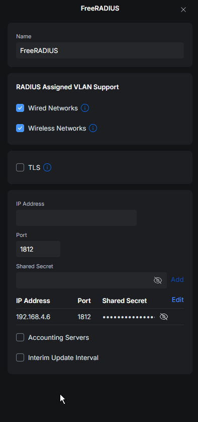

+++
title = 'Setting up FreeRADIUS with an Active Directory backend for use with Unifi WiFi'
date = 2026-03-31T15:56:30-04:00
draft = false
+++

Or in other words, how to configure 802.1x authentication with an Active Directory backend.

I wrote this for work with a few tweaks, but I figured that it would work just as well as a blog post.

Given that `$job` has a lot of people who aren't the most Linux-savvy I tried to keep it as simple as I could, but there are a lot of pieces to making this work.

It was written with Ubuntu in mind but it should work in most Linux distributions.

Debian would be a drop in replacement, something RHEL based like Rocky Linux would require more work because the path names and package names likely differ slightly.

## Installing free LetsEncrypt TLS certificates

We need to get valid TLS certificates for FreeRADIUS to use for its connection.

{}
Note, if you're in a fully corporate environment, you can bypass LetsEncrypt and use Active Directory self-signed certificates here. However, this did not fit my use case.
{}

Install [certbot](https://eff-certbot.readthedocs.io/en/stable/index.html).

```bash
sudo su
apt install certbot
```

This is how you get LE certs with an HTTP challenge - feel free to substitute it for a [DNS-01 challenge](https://letsencrypt.org/docs/challenge-types/#dns-01-challenge). I normally always use a DNS challenge, but the client I wrote this guide for has their DNS hosted at Network Solutions, who do not have support with certbot.

1. Create an A record that points to our public IP that matches the name we're issuing the certificate for.
2. We need to port forward port 80 to the FreeRADIUS box so that certbot can complete the challenge.

First, lets create our deploy hook script that will move our certs into the correct location and set ownership so that FreeRADIUS can access them.

```bash
sudo nano /opt/renewal-certs.sh
```

```bash
#!/bin/bash

CERT_RENEW_LOCATION='/etc/letsencrypt/live/freeradius.domain.tld'
CERT_INSTALL_LOCATION='/certs'
PRIVATE_KEY_NAME='privkey.pem'
PUBLIC_KEY_NAME='fullchain.pem'

# Test to make sure that install location exists and if not, create it.
if ! [[ -d "$CERT_INSTALL_LOCATION" ]]; then
        echo "Directory not found, creating."
        mkdir /certs
fi

# Test to make sure source files exist.
if ! [[ -f "$CERT_RENEW_LOCATION/$PUBLIC_KEY_NAME" ]] || ! [[ -f "$CERT_RENEW_LOCATION/$PRIVATE_KEY_NAME" ]]; then
        echo "Keys missing from $CERT_RENEW_LOCATION. Exit script."
        exit 1
fi

# Rename existing certs for safety.

mv "$CERT_INSTALL_LOCATION/$PUBLIC_KEY_NAME" "$CERT_INSTALL_LOCATION/$PUBLIC_KEY_NAME.bak"
mv "$CERT_INSTALL_LOCATION/$PRIVATE_KEY_NAME" "$CERT_INSTALL_LOCATION/$PRIVATE_KEY_NAME.bak"

# Copy the renewed certificates into place.

cp "$CERT_RENEW_LOCATION/$PUBLIC_KEY_NAME" "$CERT_INSTALL_LOCATION/$PUBLIC_KEY_NAME"
cp "$CERT_RENEW_LOCATION/$PRIVATE_KEY_NAME" "$CERT_INSTALL_LOCATION/$PRIVATE_KEY_NAME"

# Set the freerad user to be the owner of the certs.
chown -R freerad:freerad "$CERT_INSTALL_LOCATION"

# Restart freeradius so that it picks up the new cert.
systemctl restart freeradius
```

Quit out of nano with Ctrl+X and save the file.

Next, we need to make that script executable:

```bash
chmod +x /opt/renewal-certs.sh
```

Run the following command to generate the certs **(note that this assumes that you don't already have a web server running on port 80 - if you do, you should use the [`--webroot`](https://eff-certbot.readthedocs.io/en/stable/using.html#webroot) flag instead of `standalone`.)**:

```bash
sudo certbot certonly --standalone \
  -d radius.domain.tld \
  --non-interactive \
  --agree-tos \
  -m your-email@example.com
  --deploy-hook "/opt/renewal-certs.sh"
```

If successful, you should have certificates installed at `/etc/letsencrypt/live/radius.domain.tld`, and a copy of them in `/certs` that FreeRADIUS can use.

## Configuring FreeRADIUS, Samba and Kerberos

On Ubuntu, we need to disable systemd-resolved as it causes issues with `.local` addresses.

_This is not required if you’re using a different top level domain for your Active Directory like `.com` or `.org.`_

It's also not needed on Debian because they do not use systemd-resolved.

```bash
sudo rm /etc/resolv.conf
sudo systemctl disable systemd-resolved && sudo systemctl stop systemd-resolved 
sudo nano /etc/resolv.conf
```

Then enter a "nameserver" stanza like so:

```
nameserver 10.10.10.9
```

Obviously the nameserver should be your AD controller.

Quit out of nano with Ctrl+X and save the file.

Run the following commands to install Kerberos, winbind and samba (dependencies for FreeRADIUS when you want it to auth against AD):

```bash
sudo add-apt-repository universe
sudo apt install winbind samba krb5-user freeradius -y
sudo usermod -aG winbindd_priv freerad
sudo mv /etc/krb5.conf /etc/krb5.conf.bak
```

Create new krb5.conf file with the following contents:

```bash
sudo nano /etc/krb5.conf
# EXAMPLE.LOCAL should be replaced with your actual AD domain.
[libdefaults]
    default_realm = EXAMPLE.LOCAL
    dns_lookup_realm = false
    dns_lookup_kdc = false
    permitted_enctypes = aes256-cts-hmac-sha1-96 aes128-cts-hmac-sha1-96
    default_tgs_enctypes = aes256-cts-hmac-sha1-96 aes128-cts-hmac-sha1-96
    default_tkt_enctypes = aes256-cts-hmac-sha1-96 aes128-cts-hmac-sha1-96

[realms]
    EXAMPLE.LOCAL = {
        kdc = kdc.example.local
        admin_server = kdc.example.local
    }

[domain_realm]
    .example.local = EXAMPLE.LOCAL
    example.local = EXAMPLE.LOCAL
    kdc.example.local = EXAMPLE.LOCAL

[logging]
    default = FILE:/var/log/krb5.log
```

Do the same for the samba configuration file: `/etc/samba/smb.conf`

```bash
sudo mv /etc/samba/smb.conf /etc/samba/smb.conf.bak
```

```
#
# /etc/samba/smb.conf
#

# start of global variables
[global]

# server information, this is the domain/workgroup
# Replace this with whatever would come before the backslash when logging into a domain, e.g. DOMAIN\username
workgroup = DOMAIN

# Kerberos / authentication information
# Replace with the actual domain name
realm = DOMAIN.LOCAL

# replace with the linux server's hostname. You can find this info by running "hostname" in the command line.
netbios name = RADIUS1

# security used (Active Directory)
security = ADS

# EoF
```

Edit the hosts file. It should have entries for the system's FQDN, etc.

```hosts
127.0.1.1 freeradius.example.local freeradius localhost.localdomain localhost
```

Restart the samba daemon.

```bash
sudo systemctl restart smbd
```

Try to get a Kerberos ticket.

```bash
sudo kinit Administrator@EXAMPLE.LOCAL
```

Make sure that the ticket was issued:

```bash
sudo klist
```

Join the domain and make sure it's joined successfully.

```bash
sudo net ads join -U Administrator
sudo net ads testjoin
```

If the join is "OK", restart Winbind:

```bash
sudo systemctl restart winbind
```

Test Winbind by listing domain users:

```bash
wbinfo -u
```

Should get output like this:

```bash
root@freeradius:~# wbinfo -u
EXAMPLE\administrator
EXAMPLE\guest
EXAMPLE\krbtgt
EXAMPLE\testuser
```

In the file `/etc/freeradius/3.0/radiusd.conf`, change this line to `auth = yes`:

```
auth = no
```

Change or delete the password from this line in `/etc/freeradius/3.0/mods-available/eap`:

```
private_key_password =
```

Change these lines to point to your keys:

```
private_key_file = /your_private_key_location.key
# For the "cert" file - use the LetsEncrypt "fullchain.pem"
certificate_file = /your_certificate_file.cert
```

Delete or comment-out this line:

```
# ca_file = /etc/ssl/certs/ca-certificates.crt
```

If you allow all users to connect to WiFi, then edit `/etc/freeradius/3.0/mods-available/mschap` and uncomment out these two lines:

```
winbind_username = "%{mschap:User-Name}"
winbind_domain = "%{mschap:NT-Domain}"
```

And finally configure the RADIUS client (will be the Unifi APs) in `/etc/freeradius/3.0/sites-available/wifi`:

```
#
# /etc/freeradius/3.0/sites-available/wifi
#

client UniFi-APs {
	shortname	= WiFi
	virtual_server	= wifi
	# RADIUS secret - should match what you have in the Unifi Controller.
	secret          = RAD1USp4ssw0rd
  require_message_authenticator = true
	# allowed clients (the clients will be the APs, not the end user devices. Make sure you enter the right subnet here)
	ipaddr		= 10.0.0.0/24
}
server wifi {
	authorize {
		# cleans up attributes, required
		preprocess
		# we use eap authentication, required
		eap 
    mschap
	}
	authenticate {
		# mschap authentication
		Auth-Type mschap {
			mschap
		}
		# eap, this is required
		eap
	}
}

# EoF
```

Create a symlink of our RADIUS site configuration in the `sites-enabled` directory:

```bash
sudo ln -s /etc/freeradius/3.0/sites-available/wifi /etc/freeradius/3.0/sites-enabled/wifi
```

You can test your configuration by running:

```bash
freeradius -X
```

Make sure that you can connect to the WiFi network, then proceed to the next step.

Enable and start the FreeRADIUS service (this will make it run in the background and also start on boot):

```bash
sudo systemctl enable freeradius.service && sudo systemctl restart freeradius.service
```

## Configuring the RADIUS server in Unifi

Log into your Unifi network controller and go to Settings > Networks.

{}
For some reason Ubiquiti keeps moving this setting around. This is the current location of this setting as of 2026-03-31.
{}

Add a new RADIUS server.

It should look like the below:



The "Shared Secret" should be the same as the "secret" field in your FreeRADIUS site configuration.

## Connecting wireless clients

Should use "EAP-TTLS" (might be called just TTLS or Tunneled TLS, at least it is on Android).

Phase 2 auth should be MSCHAPv2.

You'll need to enter the fully qualified domain name of the RADIUS server. (radius.domain.tld, etc)

On iOS you may need to trust the certificate the first time you connect.

## Credits

[https://xenomorph.net/linux/ubuntu/misc/radius-unifi/](https://xenomorph.net/linux/ubuntu/misc/radius-unifi/)
