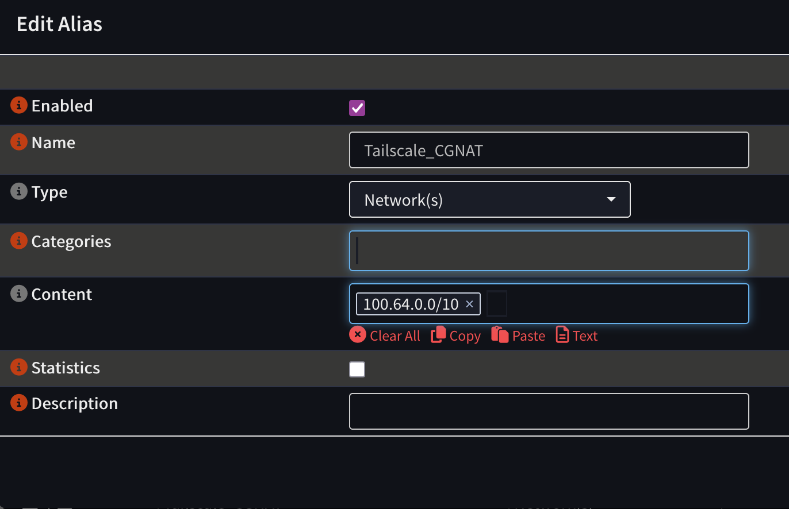
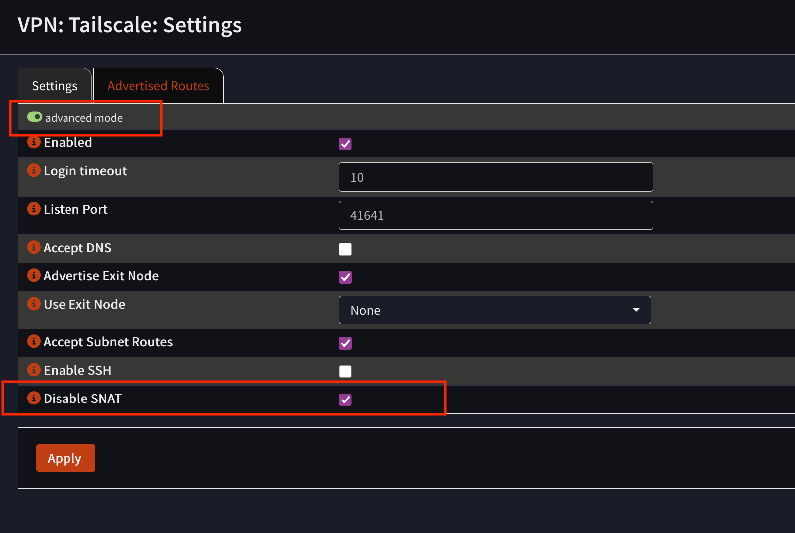
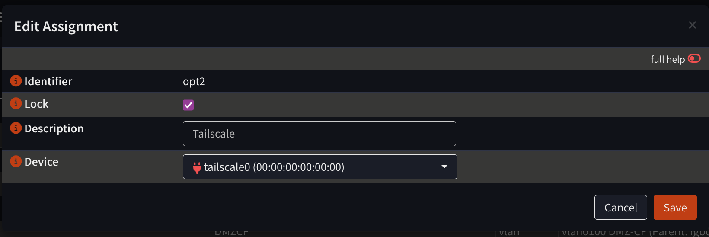
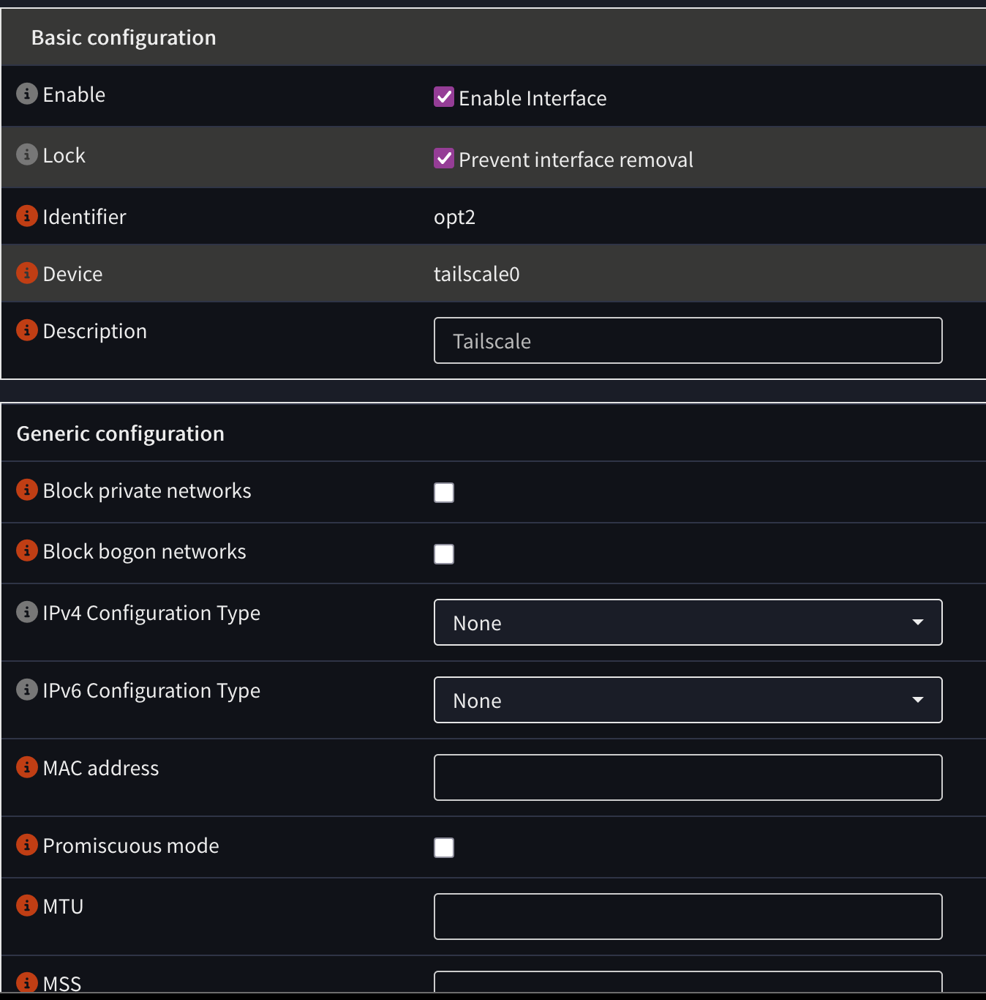
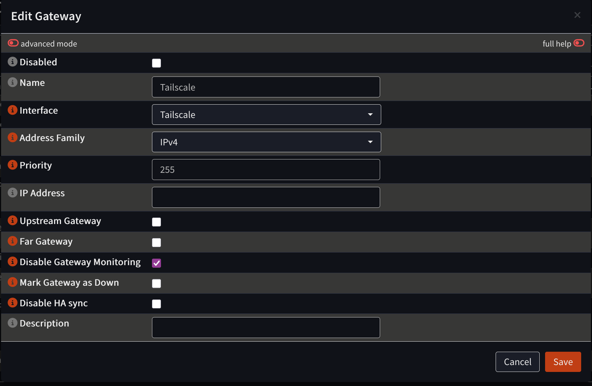
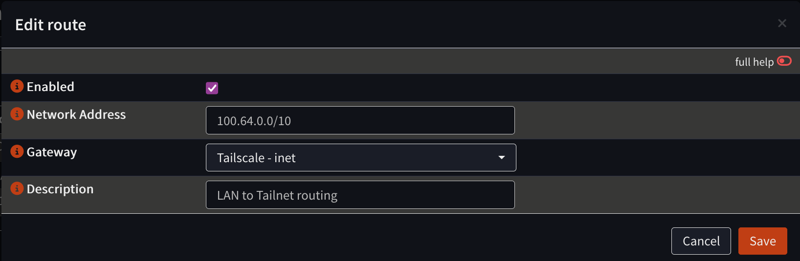
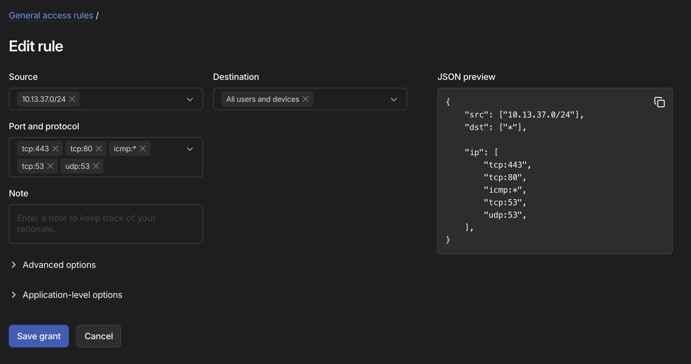
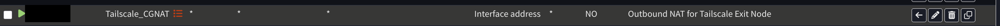

+++
title = 'Routing to Tailscale clients from a local network with OPNSense'
date = 2026-08-15T16:45:12-04:00
draft = false
+++

## Overview

Effectively, what we're trying to accomplish here today is the opposite of a Tailscale [Subnet Router](https://tailscale.com/docs/features/subnet-routers).

As in, allowing clients on our local network to talk to devices via their [Tailscale subnet IP addresses](https://tailscale.com/docs/concepts/tailscale-ip-addresses).

When I started looking into how to do this, I could not find a complete guide on the topic.

I'll do my best to do this start to finish so that anyone else can follow along with me.

## Prerequisites

1. You already have an OPNSense gateway setup and enabled as a Subnet Router on your Tailnet.
2. You'll also need to have approved the subnets that you told the Subnet Router to advertise in your admin console.

## Recommendations

Create an alias for the Tailscale subnet range so you can avoid typing it in 10x times.

Firewall > Aliases



## Explanation

Tailscale Subnet Routers by default use SNAT (Source NAT).

This means that packets sent from your Tailscale devices _to_ the Subnet Router will go through Network Address Translation on their way to the local subnets you've advertised.

So, any devices _inside_ your LAN by default will only ever see the IP address of your OPNSense gateway - they will not see the IP addresses of the individual Tailscale clients. This is the first thing that we will need to disable.

Once we have this disabled, we'll need to configure both a static route as well as firewall rules to allow the traffic to pass.

## Step by step

1. Log into your OPNSense router and navigate to VPN > Tailscale > Settings. You'll need to toggle on "Advanced Mode". Check the box for "Disable SNAT".
    
2. Now, what we need to do is create a static route - but before we can do that, we need to take care of some other items:
    1. Add the Tailscale interface by going to Interfaces > Assignments. Click on the + button and add the Tailscale interface from the dropdown. Don't forget to enable the interface - by default it will be added in a disabled state.
        
        
    2. Create a new gateway - System > Gateways > Configuration. The interface should be "Tailscale". Gateway name is technically arbitrary, but for the sake of simplicity I've also called it "Tailscale". Make sure you disable gateway monitoring.
        
    3. Now that we've done this, we can finally define our static route (System > Routes > Configuration). The Tailscale subnet is 100.64.0.0/10:
        
3. Now that we have the routing taken care of, we need to create some firewall rules to allow the traffic to pass. You'll need to create at minimum 2 rules on the OPNSense side (Firewall > Rules):
    1. On your LAN interface, define a rule that allows communication from your LAN to your Tailnet. For example -
        ```
        Interface: LAN (Or whatever yours is called)
        Action: Pass
        Source: LAN network
        Destination: 100.64.0.0/10
        ```
    2. On your Tailscale interface, define the inverse:
        ```
        Interface: Tailscale
        Action: Pass
        Source: 100.64.0.0/10
        Destination: LAN network
        ```
    Rule 1 may not be needed if you have the default "Allow All" rule in your configuration on the LAN interface. I do not, so I needed to allow that traffic.

    Feel free to restrict this traffic however you would like. Personally, I only allow through a few kinds of traffic - DNS, HTTP/HTTPS, and ICMP echo-request / echo-reply.

4. You'll also need to go into your [Tailscale ACL controls](https://console.tailscale.com/admin/acls/visual/general-access-rules) and allow access there from your local subnets.
    

5. Any device that you wish to reach via this connection needs to have the `--accept-routes` option enabled when you run `tailscale up`. The device you're trying to access needs to have a route to get _back_ to your LAN subnet, after all.

    `--accept-routes` is enabled by default on MacOS and Windows, but disabled by default on Linux. Once enabled, the device should be reachable from any device on your LAN.

6. You may also want to configure MSS clamping to avoid unnecessary IP fragmentation. Under Firewall > Settings > Normalization, click the + to add a new rule:
    ```
   Interface: Select your assigned Tailscale interface.
   Direction: Any
   Max MSS: 1240 (for standard Tailscale 1280 MTU) or 1380 (if your Tailnet uses 1420 MTU).
   Description: Clamp MSS for Tailscale traffic.
    ```

I highly recommend thinking carefully about your firewall rules and Tailscale ACLs, and what you allow to connect to what.

Now that I've gotten this working I'll be spending some time narrowing my LAN to Tailnet access ACL down to specific tags. But that's a whole other post.

## Exit Node

If, like me, you are also using your home OPNSense gateway as a Tailscale [Exit Node](https://tailscale.com/docs/features/exit-nodes), you'll quickly realize that this process broke it.

The fix is simple, we need to add an Outbound NAT rule to replace the missing SNAT on the Tailscale service.

Go to Firewall > NAT > Outbound.

Your Outbound NAT mode must be set to "Hybrid" or "Manual". If you don't know what this means, set it to "Hybrid".

Configure a rule that looks like this:

```
Interface: WAN
Source address: 100.64.0.0/10
Destination address: any
Translation target: Interface address
```

.
