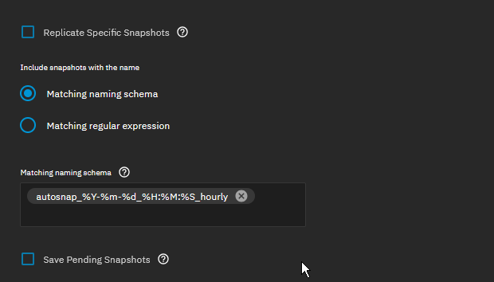

+++
title = 'Deduplicated Proxmox backups with Proxmox Backup Server and ZFS'
date = 2026-04-22T23:23:10Z
draft = false
+++

## Overview

There are many ways to back up your [Proxmox](https://proxmox.com/en/products/proxmox-virtual-environment/overview) virtual machines.

One of the most popular ways to do so is via [Proxmox Backup Server](https://proxmox.com/en/products/proxmox-backup-server/overview), which gives you many advantages:

- Deduplication of common data.
- The ability to cherry pick files out of your backups.
- Tight integration with the Proxmox ecosystem.

However, how is one to achieve proper 3-2-1 backups using this mechanism?

One way is to run multiple datastores, some local and some using Amazon S3 compatible endpoints.

However, this is a bit much for me, so I came up with a simpler method.

## The Details

I run my PBS on a [Beelink N100 mini PC](https://www.amazon.com/dp/B0BVFKN7ZL), in which I've installed a 2TB SATA SSD that I formatted as a single disk zpool.

I then installed Jim Salter's excellent [Sanoid](https://github.com/jimsalterjrs/sanoid) utility, configuring ZFS snapshots on the PBS server.

This is the `/etc/sanoid.conf` that I've defined. You can, of course, set whatever values you like.

```
[pbs-local/datastore]
        use_template = pbs
        recursive = yes

[template_pbs]
        frequently = 0
        hourly = 36
        daily = 3
        weekly = 1
        monthly = 0
        yearly = 0
        autosnap = yes
        autoprune = yes
```

Then, once I had my initial snapshots, I went to my TrueNAS backup server and created a new ZFS replication task.

I used this to _pull_ the snapshots for the datastore to the backup server.

The key is to match the expected snapshot naming schema for Sanoid, like so:



This allows me to maintain the deduplicated nature of the Proxmox Backup Server datastore.

  You can do the same with any offsite NAS that you may have, as long as it's running ZFS. This is easily accomplished with something like [Tailscale](https://tailscale.com) or [Netbird](https://netbird.io/).

If I ever have a failure of the Proxmox Backup Server, I can simply set up a new zpool on the repaired system and reverse the direction of the replication.

I also use [ZFS Delegation](https://klarasystems.com/articles/improving-replication-security-with-openzfs-delegation/) to avoid doing the replication as root, but I've [covered this topic before](https://blog.ssb-tech.net/posts/truenas-zfs-replication-without-root/).

As always - trust nothing and test those backups!
