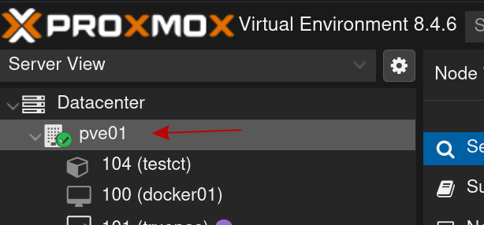

+++
title = 'Proxmox Setup Notes'
date = 2025-08-07T22:02:02-04:00
draft = false
+++

# Proxmox installation steps

## Overview

This post is a reference for me and anyone else that finds it useful.

I've never bothered documenting this before, which leads me to missing stuff every time I set up a new box.

This post will continue to be updated if I add anything new.

## Installation

- The primary thing to get right here is the storage configuration. Even if it's a single disk I will typically do ZFS.
  - Click on Options. Choose whichever ZFS topology you want.
  - Click on Advanced Options. Change Compression from "on" to "lz4". This is the default anyway, but I like to be sure.
  - `ashift` should be set to 12 or 13. I typically do 12, as this targets 4k physical sectors.
  - Make sure that you have the correct disks selected. Any disk you do not want to be part of the boot pool should be set to "do not use".
- For the rest of the setup you can pretty much just click Next Next Next. I do recommend setting the correct time zone and a good DNS server.

## Post-Install

- If you don't have an Enterprise subscription we need to disable the enterprise repository and enable the one for no-subscription.
  - Click on the individual node (not Datacenter) and go to Updates > Repositories.
    
  - Click on Add and select `No Subscription` from the dropdown.
  - Next, select the repositories labeled "Enterprise" and disable them.
- Enable Debian Non-Free-Firmware repository.
  - This one can't be done through the GUI. SSH in or use the web shell.
  - Edit the sources
    ```bash
    vim /etc/apt/sources.list.d/pve-no-enterprise.list`
    ```
  - Add the following repo, replacing $VERSION with your release's Debian base (bookworm, trixie):
    ```bash
    https://deb.debian.org/debian $VERSION main non-free-firmware
    ```
  - Install the firmware microcode for your hardware vendor
    - Run `apt update`
    - `apt install intel-microcode` OR `apt install amd64-microcode`
- At this point, update the system. Reboot if needed.
- Next, lets fix the ZFS configuration.
  - Click on the `Datacenter` tab and go do down to `Storage`.
  - Select your zpool (or pools) and click Edit. You will have to do this for every pool individually.
  - Enable thin provisioning.
  - Change the Block Size to 64k or 128k. Either is probably fine, but the default 16k is abysmal for VM disks. This setting is the `zvol` equivalent to the `recordsize` property on datasets. Having this not match your workload will usually result in massive write amplification. This is why ZFS got a reputation for quickly killing SSDs, but it doesn't have to if you configure your pool correctly.
- Click on the individual node again. Go to `System > Network` and select any bridges that you've created. Set them to be VLAN-aware.
- Set up the notification system under `Datacenter > Notifications`. I will typically have it send me only backup failure notices and warnings about things like failed disks.
- I will typically set up a VM template at this stage to save myself a bunch of work later. See links below for options.

## Other Notes

If you're trying to set up a new ZFS storage pool and the disks aren't showing up in the interface - the Proxmox interface will not show you any disks that have partitions on them.

If you're expecting a drive to show up and it's not you can go through the following procedure on the command line.

- `lsblk` to find the path of the drive that you need to wipe.
  ```bash
  lsblk -o NAME,SIZE,MODEL
  ```
- Wipe out all of the partitions.
  ```bash
  wipefs -a /dev/sdX
  ```
- The ZFS labels (which contain pool metadata) may survive `wipefs` as it's stored on the first few sectors of the drive, so lets make sure that any existing labels are gone. If this drive has never been used in a zpool before, you can skip this step.
  ```bash
  zpool labelclear /dev/sdX
  ```
- Try creating your pool again.

## Links

- [Reddit comment explaining the effect of a poorly matched recordsize property](https://old.reddit.com/r/zfs/comments/8l20f5/zfs_record_size_is_smaller_really_better/dzc9669/)
- [Setting up a cloud-init VM template](https://technotim.live/posts/cloud-init-cloud-image/)
- [A repository for Packer templates for Various OS images](https://github.com/traefikturkey/oncall)
- [Automate Creating VM templates on Proxmox with Packer](https://guneycansanli.github.io/my-blog/Automate-Creating-VM-templates-on-Proxmox-with-Packer/)
